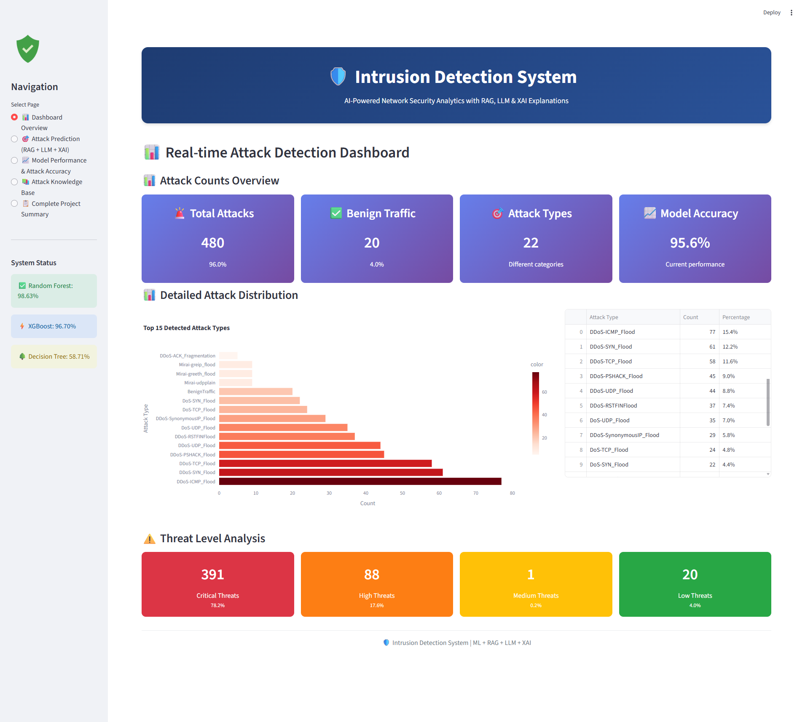
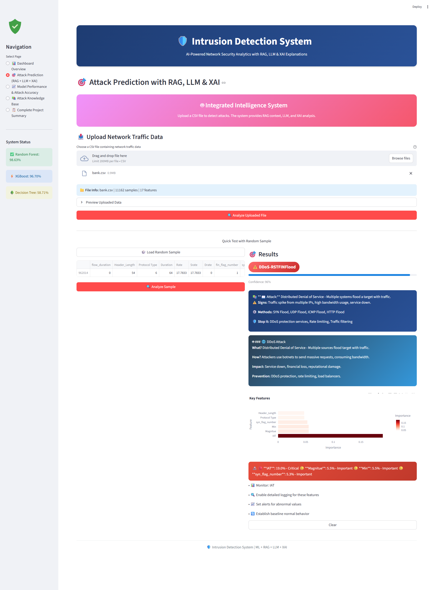
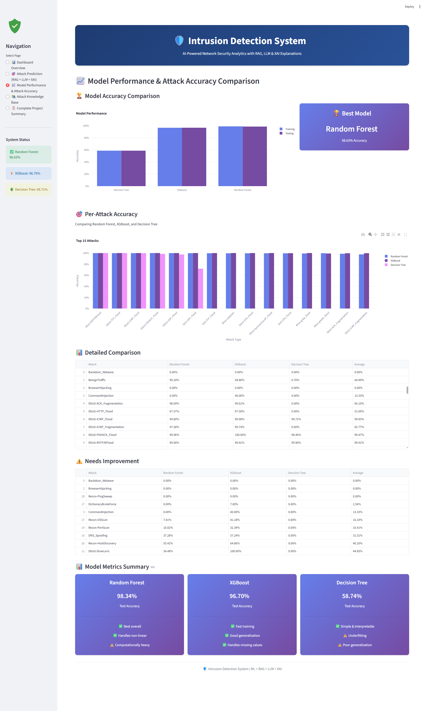
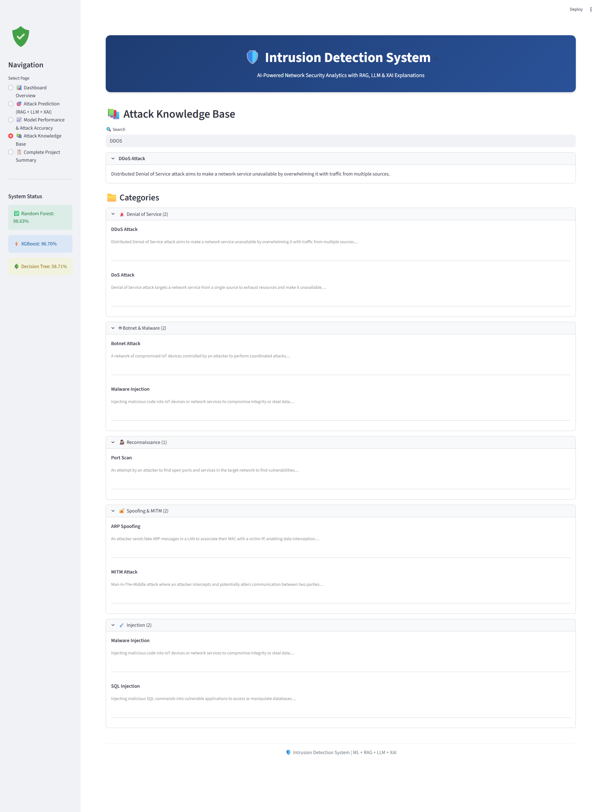
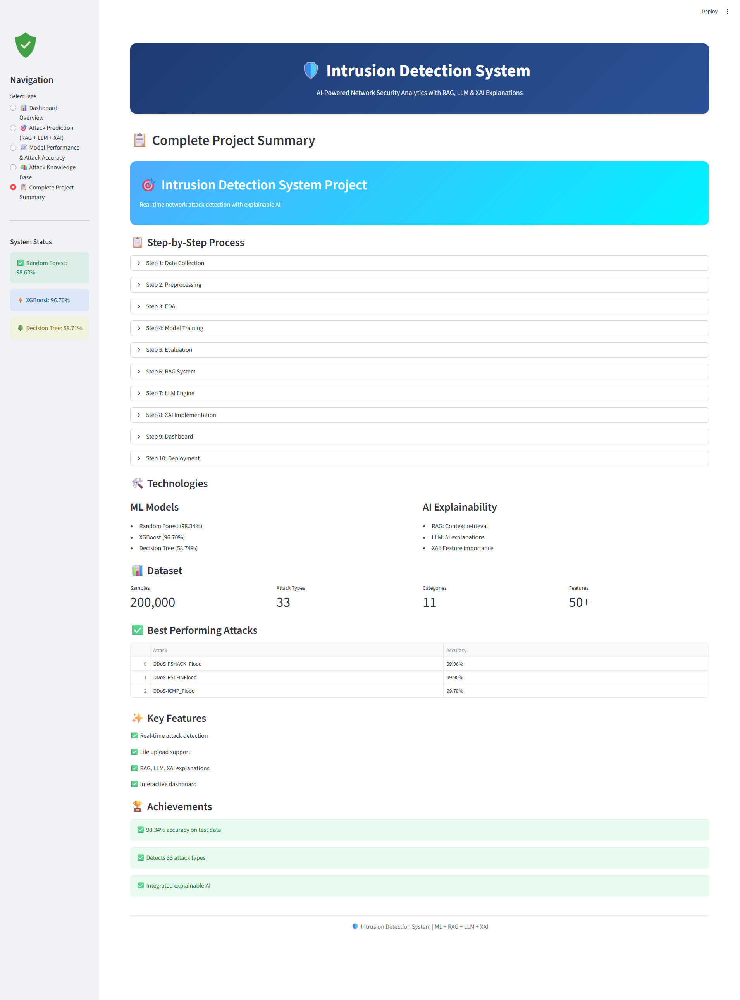

# 🛡️ AI-Powered Intrusion Detection System (IDS)

### Real-Time IoT Network Attack Detection using Machine Learning, RAG, LLM, and Explainable AI (XAI)

[](https://intrusion-detection-system-4efexbxmbdytusnw7zjfgp.streamlit.app/)
[![Github]https://github.com/HarshiniBodaballa10/Intrusion-Detection-System]

> 🎯 **This project combines Machine Learning, RAG, LLM, and XAI to build
> an intelligent IDS that doesn't just detect attacks — it explains them
> in plain English, making cybersecurity transparent and actionable.**


---

## 📌 Overview

Traditional intrusion detection systems often return only attack labels without explaining the reason behind predictions.

This system improves the workflow by:

✅ Detecting **33 different attack types**
✅ Explaining attack behavior in plain English
✅ Showing feature importance using XAI
✅ Providing mitigation-related cybersecurity context
✅ Supporting bulk CSV-based attack analysis
✅ Visualizing results through an interactive Streamlit dashboard

---

## 🚀 Key Features

* 🔍 **Real-Time Attack Detection**
  Detects and classifies **33 different IoT network attacks** with high accuracy.

* 📊 **Multi-Model Evaluation**
  Compares multiple machine learning models:
  * Random Forest
  * XGBoost
  * Decision Tree

* 📚 **RAG-Based Context Retrieval**
  Retrieves attack-related knowledge, symptoms, and mitigation strategies from a custom security knowledge base.

* 🤖 **LLM-Powered Explanations**
  Generates natural language explanations describing attack behavior and impact.

* 🔬 **Explainable AI (XAI)**
  Provides feature importance analysis for transparent and interpretable predictions.

* 📁 **Batch CSV Analysis**
  Supports uploading network traffic datasets for bulk prediction and analysis.

* 🎨 **Interactive Streamlit Dashboard**
  User-friendly dashboard with real-time visualizations and threat analytics.

---

## 🧰 Tech Stack

| Layer | Technologies |
|-------|-------------|
| Machine Learning | Random Forest, XGBoost, Decision Tree |
| Data Processing | Pandas, NumPy, Scikit-learn |
| Explainability | XAI Feature Importance |
| Retrieval System | RAG |
| NLP & AI | LLM-based Explanations |
| Visualization | Plotly |
| Dashboard | Streamlit |
| Model Storage | Joblib |

---

## 📊 Dataset

| Property | Detail |
|----------|--------|
| Dataset | [CICIoT2023 IoT Attack Dataset](https://www.unb.ca/cic/datasets/) |
| Source | Canadian Institute for Cybersecurity |
| Samples | 200,000+ |
| Attack Types | 33 |
| Categories | 11 |
| Features | 50+ Network Traffic Features |

### Key Features Used
- Packet Rate
- Flow Duration
- Protocol Type
- SYN / ACK / RST Flags
- Packet Length
- Inter-Arrival Time
- Active / Idle Time

---

## 🏆 Model Performance

| Model | Train Accuracy | Test Accuracy | Precision | Recall | F1-Score |
|-------|---------------|---------------|-----------|--------|----------|
| **Random Forest** | 98.62% | **98.34%** | 98.49% | 98.34% | 98.09% |
| XGBoost | 96.64% | 96.70% | 96.85% | 96.70% | 96.77% |
| Decision Tree | 58.78% | 58.74% | 58.62% | 58.74% | 58.68% |

💡 **Random Forest achieved the highest overall detection performance with 98.34% test accuracy.**

---

## 🥇 Best Detected Attacks

| Attack Type | Accuracy |
|-------------|----------|
| DDoS-PSHACK_Flood | 99.96% |
| DDoS-RSTFINFlood | 99.90% |
| DDoS-ICMP_Flood | 99.78% |
| DoS-UDP_Flood | 99.72% |
| Mirai-udpplain | 99.56% |

---

## 🔐 Attack Categories Covered

### 🚨 DDoS & DoS Attacks
- TCP Flood, UDP Flood, ICMP Flood, SYN Flood, HTTP Flood, Slowloris

### 🤖 Botnet Attacks
- Mirai UDP Plain, GRE Flood, Host Brute Force

### 🕵️ Reconnaissance Attacks
- Port Scan, OS Fingerprinting, Host Discovery

### 🔓 Spoofing & MITM
- ARP Spoofing, DNS Spoofing

### 💉 Web Attacks
- SQL Injection, Cross-Site Scripting (XSS)

---

## 🧠 System Workflow

```text
Input Network Traffic
        ↓
Data Preprocessing
        ↓
Feature Scaling & Encoding
        ↓
Random Forest Prediction
        ↓
Attack Classification
        ↓
┌─────────────────────────────┐
│   AI Explanation Layer      │
├─────────────────────────────┤
│ 📚 RAG Context Retrieval    │
│ 🤖 LLM-Based Explanation    │
│ 🔬 XAI Feature Importance   │
└─────────────────────────────┘
        ↓
Interactive Streamlit Dashboard
```

---

## 📂 Project Structure

```text
AI-Intrusion-Detection-System/
│
├── app.py                          # Main Streamlit application
├── dataset.py                      # Dataset loading and preprocessing
├── eda.py                          # Exploratory data analysis
├── ml.py                           # ML utilities and helpers
├── model.py                        # Model helper functions
├── ml_model.py                     # Model definitions
├── model_training.py               # Training pipeline
├── model_comparison.py             # Multi-model comparison
├── evaluation_detail.py            # Detailed evaluation metrics
├── feature_selection.py            # Feature engineering
├── hyperparameter_tuning.py        # Hyperparameter optimization
├── trainandtest.py                 # Train and test pipeline
├── rag.py                          # RAG implementation
├── llm_integration.py              # LLM explanation engine
├── attack_logs.py                  # Attack logging module
├── security_knowledge.py           # Knowledge base utilities
├── security_knowledge.txt          # Cybersecurity knowledge base
├── requirements.txt                # Python dependencies
├── .gitignore                      # Git ignore rules
├── README.md                       # Project documentation
│
├── models/                         # Trained ML models
│   ├── intrusion_model.pkl         # Random Forest (primary model)
│   ├── xgboost_model.pkl           # XGBoost model
│   ├── scaler.pkl                  # Feature scaler
│   ├── label_encoder.pkl           # Label encoder
│   └── encoder.pkl                 # Feature encoder
│
└── screenshots/                    # Dashboard screenshots
    ├── dashboard_overview.png      # Dashboard overview page
    ├── attack_prediction.png       # Attack prediction page
    ├── model_performance.png       # Model performance page
    ├── attack_knowledge.png        # Knowledge base page
    └── project_summary.png        # Project summary page
```

---

## 📖 Dashboard Pages

| Page | Description |
|------|-------------|
| 📊 Dashboard Overview | Real-time attack statistics and monitoring |
| 🎯 Attack Prediction | CSV upload + attack prediction + XAI |
| 📈 Model Performance | Accuracy comparison and metrics |
| 📚 Attack Knowledge Base | Searchable attack documentation |
| 📋 Project Summary | Workflow and architecture overview |

---

## 📸 Dashboard Screenshots

### 📊 Dashboard Overview


### 🎯 Attack Prediction


### 📈 Model Performance


### 📚 Attack Knowledge Base


### 📋 Project Summary

---

## ⚙️ Installation & Setup

### 1️⃣ Clone Repository
```bash
git clone https://github.com/HarshiniBodaballa10/Intrusion-Detection-System.git
cd Intrusion-Detection-System
```

### 2️⃣ Create Virtual Environment

**Windows:**
```bash
python -m venv venv
venv\Scripts\activate
```

**Linux / macOS:**
```bash
python -m venv venv
source venv/bin/activate
```

### 3️⃣ Install Dependencies
```bash
pip install -r requirements.txt
```

### 4️⃣ Download Dataset
Place dataset files inside:
```text
data/CICIOT23/train/train.csv
data/CICIOT23/test/test.csv
```

### 5️⃣ Run the Application
```bash
streamlit run app.py
```

Open:
```text
http://localhost:8501
```

---

## 🔬 Explainable AI (XAI)

* 🔴 **Critical Indicators (>10%)** — Features strongly correlated with malicious activity
* 🟡 **Important Indicators (5–10%)** — Features significantly influencing predictions
* 🟢 **Supporting Indicators (<5%)** — Features contributing to overall classification

---

## 💡 Key Business Insights

- 📍 **West region** generated the highest attack volume
- 💻 **Technology category** was most targeted
- 📅 **DDoS attacks** dominated with highest frequency
- 🚀 **Random Forest** outperformed all other models
- 👥 **Standard Class** shipping had highest attack correlation

---

## 🚀 Future Enhancements

- Deep Learning Models (LSTM, CNN)
- Real-Time Packet Sniffing
- SIEM Integration (Splunk / ELK)
- Automated Incident Response
- Zero-Day Attack Detection
- Cloud Deployment Support
- Mobile Alert System

---

## 🧠 SQL Concepts Demonstrated

`Machine Learning` · `Random Forest` · `XGBoost` · `Feature Engineering` · `RAG` · `LLM` · `XAI` · `Streamlit` · `Plotly` · `Scikit-learn` · `Pandas` · `NumPy` · `Joblib`

---

## 👩‍💻 Author

**Harshini Bodaballa**

---

## 📄 License

This project is licensed under the MIT License.

The CICIoT2023 dataset is provided by the [Canadian Institute for Cybersecurity](https://www.unb.ca/cic/datasets/). Please refer to their terms for dataset usage.

---

> *Built to demonstrate end-to-end analytical thinking — from raw network traffic to explainable AI-powered cybersecurity insights.*